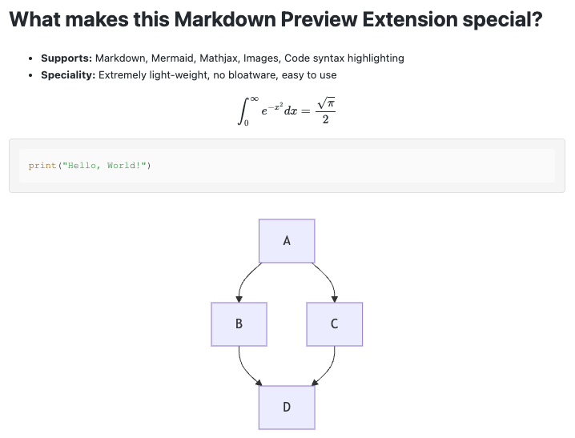

# Lightweight Markdown Preview

A minimal VS Code extension for previewing Markdown with Mermaid diagrams and MathJax support. **No bloat. No configuration. Just markdown.**

## Why This Extension?

- **Lightweight:** ~38 KB packaged (no massive dependencies)
- **Privacy-Friendly:** No tracking, no analytics, no data collection. Your markdown stays on your machine
- **Simple:** ~300 lines of code, easy to understand and maintain
- **Fast:** Live preview updates as you type
- **Secure:** Content Security Policy, nonce-based script execution
- **One Job:** Previews Markdown. That's it. No themes, no plugins, no bloat.

## Features

- Real-time Markdown preview in a side panel
- All standard Markdown elements (headings, lists, tables, code blocks, images, etc.)
- Full Mermaid diagram support (flowcharts, sequences, state diagrams, etc.)
- MathJax support for LaTeX equations

## Install

1. Open VS Code
2. Go to Extensions
3. Search for "Lightweight Markdown Preview"
4. Click Install
5. Start previewing your Markdown file by clicking the "Eye" icon in the top-right corner or using the Command Palette (`Ctrl+Shift+P` > `Markdown: Show Lightweight Markdown Preview`)

## Technical Details

- See [DEVELOPMENT.md](/docs/development.md) for:
	- How to develop, test, and release
	- Architecture and design decisions
- See [ARCHITECTURE.md](/docs/architecture.md) for:
	- In-depth explanation of the extension's architecture
	- Key design patterns and decisions
